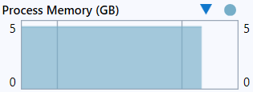

# veikimas
- programa sukuria duomenų failą su nustatytais parametrais (studentų skaičius, namų darbų kiekis).
- galima pasirinkti ar galutinis pažymys bus skaičiuojamas su vidurkiu ar mediana.
- galima pasirinkti kiek namų darbų turės studentai.
- programa automatiškai sugeneruoja failų pavadinimus pagal tai kiek yra studentų.
- studentai pagal galutinį pažymį išskirstomi į dvi grupes >5: "vargšelis", <="kietekas".
- į rezultatų failus išvedami "kietekai" ir "vargšeliai".
- yra spartos analizė.
- skaičiuojama su skirtingais duomenų kiekiais (1k, 10k, 100k, 1mil, 10mil*).

# pastaba:
- su labai dideliais duomenimis (10 milijonų) programa gali užlūžti :( (bet gali ir neužlūžti :D )
- programos veikimas užima daug vietos, vien sukuriami failai užima virš 1,15GB duomenų:

# išvedimo pavyzdys:

