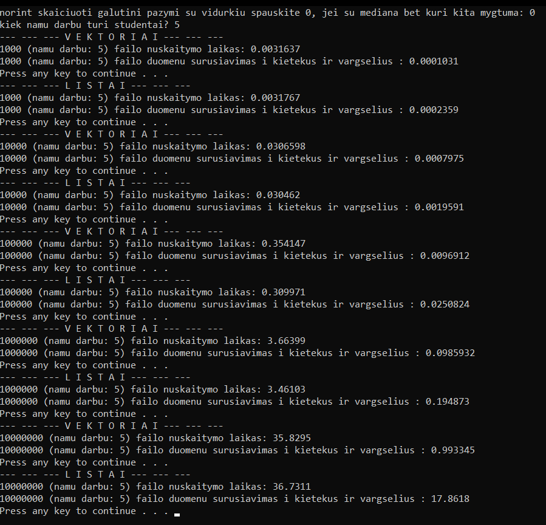

# v0.5

## Veikimas
Programos veikimas yra toks pats kaip ir V0.4 tačiau yra keli skirtumai:
- dabar skaičiavimai yra atliekami du kartus: 1) su vektoriais 2) su listais.
 - kadangi tiek duomenų failų sukūrimas, tiek rezultatų įrašymas į failus yra analogiški su vektoriais ir su listais, dėl to šių operacijų laiko skaičiavimo programa neatlieka. Programa atlieka tik nuskaitymo iš duomenų failo ir rūšiavimo į dvi grupes laiko skaičiavimus.

## Pastabos:
- Kaip ir V0.4 versijoje atliekant veiksmus su dideliais kiekiais (10 mil.) programa gali užlūžti.
- Kadangi programa atlieka tuos pačius veiksmus ir su vektoriais ir su listais, vadinasi bus sukurti ir du kartus daugiau galutinių rezultatų failų, dėl to reikia turėti galvoje, kad kompiuteryje reikia turėti laisvos atminties.

## Kompiuterio parametrai
testavimas buvo altiktas kompiuteriu, kurio parametrai yra tokie:
- Processor	Intel(R) Core(TM) i5-8265U CPU @ 1.60GHz, 1800 Mhz, 4 Core(s), 8 Logical Processor(s)
- 8 GB RAM
- SSD 

## Testavimo rezultatai

## Įdomu pastebėti, kad:
- failo nuskaitymo laikas, kai duomenų yra nuo 10000 iki 1000000, įvyksta greičiau naudojant listus, o  kai duomenų yra 1000 ir 10 mil. įvyksta greičiau naudojant vektorius.
- nepaisant duomenų kiekio, visais atvejais duomenų suskirstymas į kietekus ir vargšelius įvyksta daugiau nei du kartus greičiau naudojant vektorius negu listus.
