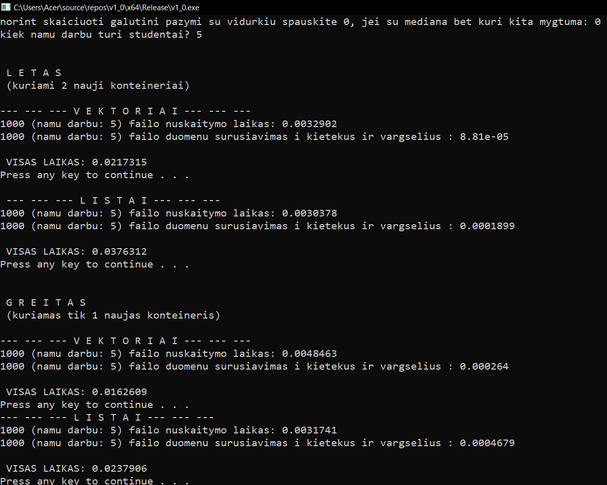
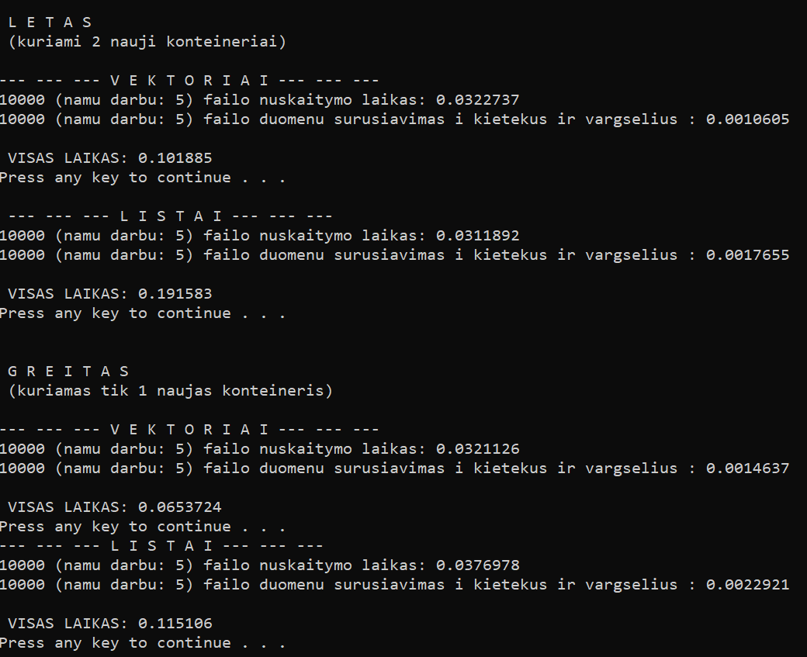
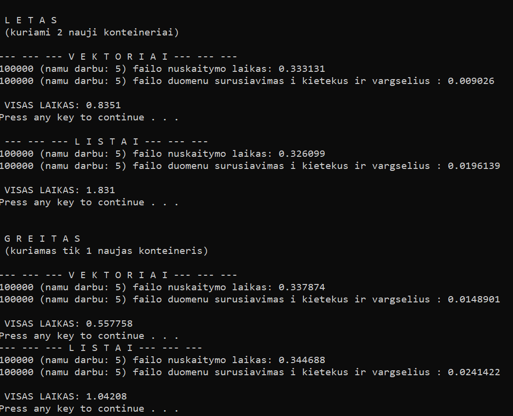
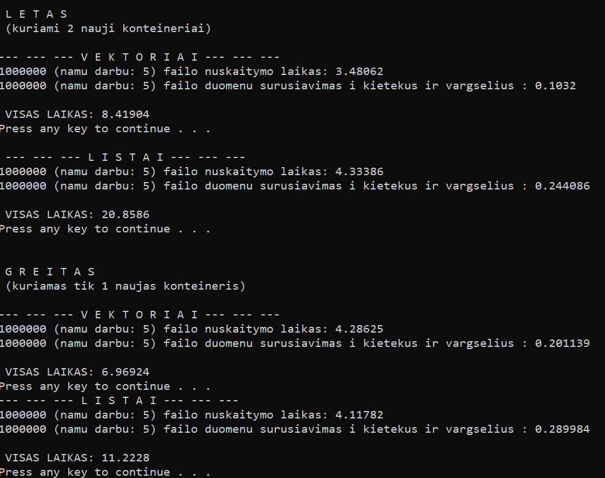
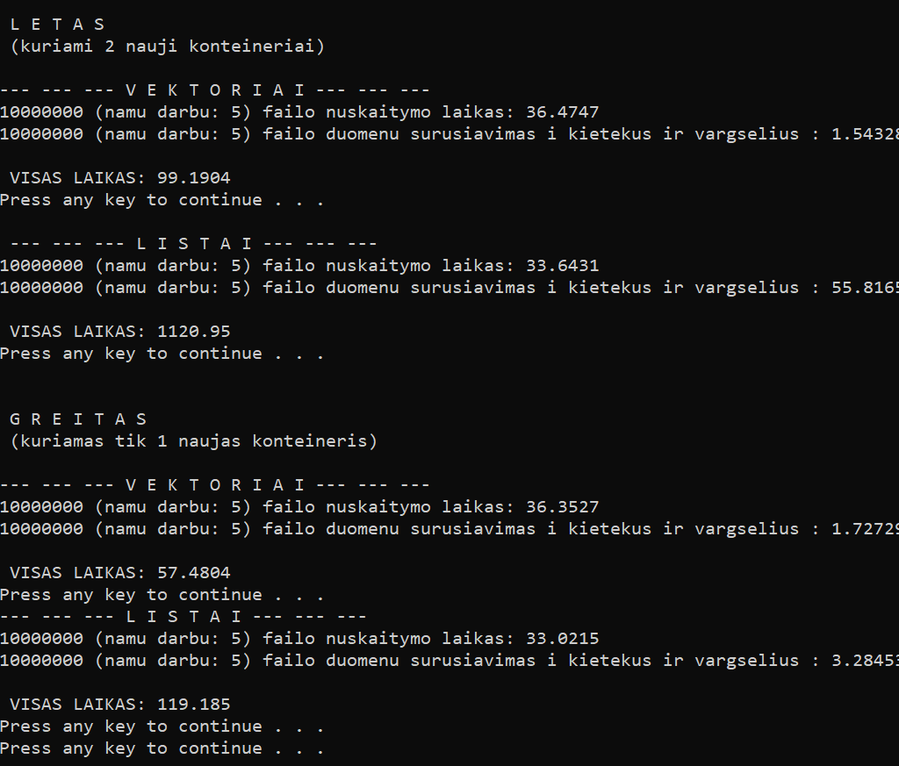

# v1.0
[atgal į master](https://github.com/AntanasU/projektinis-darbas)
## Veikimas
Programa atlieką tuos pačius skaičiavimus kaip ir praeitoje versijoje, tik skirtingais būdais:
 - naudojant vektorius, skirstant studentus į du naujai sukuriamus vektorius
 - naudojant listus, skstant studentus į du naujai sukuriamus vekktorius
 - naudojant vektorius, kuriant tik vieną naują "vargšiukų" vektorių ir tuos "vargšiukus" pašalinant iš pradinio vektoriaus, taip pradinis vektorius tampa "kietekais"
 - naudojant listus, kuriant tik vieną naują "vargšiukų" listą ir tuos "vargšiukus" pašalinant iš pradinio listo, taip pradinis listas tampa "kietekais"
 ## Instrukcijos
 Yra dvi funkcijos: greita ir lėta. Kiekvienoje iš jų yra realizacija su vektoriais ir su listais.
 ## Struktūra
 kurimas.cpp faile yra failų generavimas. L_funkcijos.cpp faile yra programos veikimas su listais (greitas veikimas- L_greitas ir lėtas veikimas- L_letas). V_funkcijos.cpp faile yra programos veikimas su vektoriais (greitas- V_greitas ir lėtas- V_letas). bendra.cpp faile yra vektorių ir listų veikimo "apjungimas" tiek greitu, tiek lėtu variantais. v1_0.cpp faile yra main funkcija.
 ## Pastabos
 Kadangi visi realizavimai yra pateikti viename .cpp faile, tai programos veikimas su kiekvienu duomenų dydžiu (1k, 10k, 100k, 1m, 10m), sukuria po 3 failus versijose, kur kuriami 2 nauji konteineriai ir 2 failai, kur kuriamas tik vienas failas ir šalinami perkelti duomenys. Taigi norint sėkmingai įvykdyti visas programos realizacijas reikalinga nemažai laisvos atminties. Taip pat kadangi atliekama nemažai veiksmų, tai norint viską paskaičiuot reikalinga ir nemažai laiko (man visas programos veikimas užtruko apie 24 minutes)
 ## Testavimo rezultatai
 - 1000 duomenų
 
  - 10,000 duomenų
 
  - 100,000 duomenų
 
  - 1,000,000 duomenų
 
  - 10,000,000 duomenų
 
 ## Išvados
 - duomenų nuskaitymas į vektorius užtrunka greičiau nei į listus
 - greituoju variantu, paradoksaliai, užtrunka ilgiau surušiuoti į "vargšiukus" ir "kietekus", nei lėtuoju variantu, tiek su vektoriais tiek su listais (neaišku dėl ko, bet versijoje su 10,000,000  greitojo varianto rūšiavimas su listais užtruko trumpiau nei su lėtuoju variantu)
 - visas programos veikimas greituoju veikimu, tiek su listais, tiek su vektoriais užtrunka kur kas greičiau nei lėtuoju variantu. Tai ypač gerai su dideliais duomenų kiekisis (ypač su listais).
 - su vektoriais, skirtumas tarp greito ir lėto veikimo yra mažesnis nei skirtumas tarp greito ir lėto veikimo su listais. Su vektoriais skirtumas yra iki 2 kartų, o su listais su 10,000,000 duomenų beveik 10 kartų.
